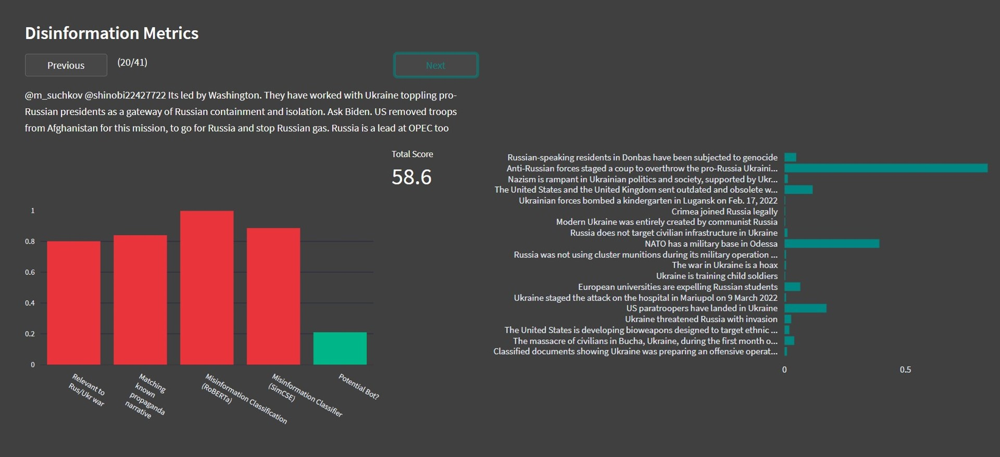

# STADFEST: An Open Source Disinformation Analyser for TIDE Hackathon 2023

## Summary

The task of classifying disinformation is a complex one. When we as humans do it, we typically look at muliple factors at once and make a decicion based on the combined information.

This the idea that we have tried to implement in our solution, that we have named STADFEST - a Norwegian word meaning *confirm*.

Our solution takes the input in the form of the text content, as well as metadata, and provides the user with a disinformation dashboard, where multiple different language models give their output, all providing their own evaluation. This detailed insight should hopefully make a more complex analysis available to the user, allowing for more transparancy as to how the conclution regarding the total disinformation score is reached.

### Recogizing common disinformation narratives
One of the core components of out solution is the ability to recognice known propaganda talking points. Being able to compare any text to a set of common misinformation with our *[NLI based Zero-Shot](https://joeddav.github.io/blog/2020/05/29/ZSL.html) Narrative Recognizer*, we can give a strong indication not only as to *if* the content is misinformation, but *what type* of misinformation we are dealing with. As a base we used the statements gathered in the OECD paper [*Disinformation and Russia’s war of aggression against Ukraine*](https://www.oecd.org/ukraine-hub/policy-responses/disinformation-and-russia-s-war-of-aggression-against-ukraine-37186bde/), but the user is free to remove or add any information they please.

### Recognizing relevancy to the war
In addition to the Narrative Recognizer, we have created *Russia/Ukraine War Relevancy*- classifier that uses [SimCSE](https://github.com/princeton-nlp/SimCSE) as a backbone and trained the [data](/data) using pseudo-labels that we created using principle component analysis and hashtags.

### General disinformation classifier
We also built *Misinformation Classifier* that uses a [RoBERTA](https://huggingface.co/roberta-base)-backbone and finetuned in on the data using the Narrative Recognizer and manual verification to create labels.

### Flagging potential bot Twitter accounts
Some disinformation on Twitter is posted by bot accounts. To recognize these messages, we have created a simple bot detector. To flag potential bot posts, it uses the age of the account at the time of posting, as well as the account's number of followers, working on the assumption that bots are more likely to be new accounts and have few followers.

[EN TIL MODELL HER??]

*All the code for our models are placed in [models](models), and a more in depth info about them can be found below.*

### Front-end
For the front-end of STADFEST we have implemented a web application using the open source [Streamlit](https://streamlit.io/) python framework. It is flexible in that it can both be run as a server application or off-line on local machine. The application can run on single text entries, or on a full .csv dataset. The output of our mupltiple models are displayed in conveniant graphs using the [Plotly](https://plotly.com/python/) library. The scripts that build the application are in [WebApp](WebApp/)

## Architecture

Our core architecture consists of a collection of models that each provide analysis that can be used as indicators of disinformation.
Together they form the architecture described above. This section gives a detailed description of the components.

### The Zero Shot Narrative Recognizer
A pre-trained NLI (natural language inference) models as a ready-made zero-shot sequence classifiers. The method works by posing the sequence to be classified as the NLI premise and to construct a hypothesis from each candidate label. For example, if we want to evaluate whether a sequence belongs to the class "politics", we could construct a hypothesis of "This text is about politics..", and a premise of "This year I will vote for Joe Biden". The probabilities for entailment and contradiction are then converted to label probabilities. We use this model with known propaganda narratives as hypothesis (e.g. "The United States is developing bioweapons designed to target ethnic Russians and has a network of bioweapons labs in Eastern Europe"), and the twitter content text as the premise.

bart-large-mnli: https://huggingface.co/facebook/bart-large-mnli

### The SimCSE Relevancy Classifier

### The Disinformation Classifier
This is a finetuned LLM (roberta-base) designed to classify misinformation. The misinformation data was gathered from 
the twitter dataset by using a pretrained zero-shot natural language inference (bart-large-mnli) to find tweets that contain known disinformation
narratives about the Russian invasion of Ukraine. The suggestions from the zero-shot model was manually verified before they were added to the dataset.

roberta-base: https://huggingface.co/roberta-base

### The Bot Detector

### The Total Score

[Bilde av arkitektur her!]

## Data

We modified the dataset provided by the Polish Cyber Command to extract the information we wanted on a more detailed format. The scripts used to create our modeified dataset as well as a summary of what we did can be found in [data](data/).

Our dataset and labels can be found on Azure: [LINK]

### Dataset modification

- Concatinated all twitter datasets
- Removed duplicates
- Added a column of hashtag free text
- Extracted user information on a more readable format and added a column to dataframe for each data point
- Calculated the age of the account at the time of each tweet

### Labelling protocol

Pseudo labelling of the data was done in a few diffrent ways.

**Semantic likeness to known propaganda**
We used semantic likeness to known propaganda talking points, to create a misinformation/non misinformation label, using our *Zero-Shot Narrative Recognition* model. Read more about our models in the [README](../)

For a small subset, we manually verified 50 instances of misinformation in the dataset and made a dataset containing those 50 samples 
as well as 100 random samples that could be used as and a tiny training dataset.

We repeated the process to create a small test and demo dataset, so that we could ensure to have **train-test-split** for more reliable verification of our results.

The indexes of the verified misinformation entries are stored as .txt files and are available on Azure, together with our modified dataset.

**PCA**
We also did [principle component anlysis](https://en.wikipedia.org/wiki/Principal_component_analysis) on data to divide it into binary classes. Tweets with a pro Ukranian sentiment seemed to cluster, as illustrated below, where tweets marked with the #StandWithUkraine hashtags is coded in orange.

## Sample Results