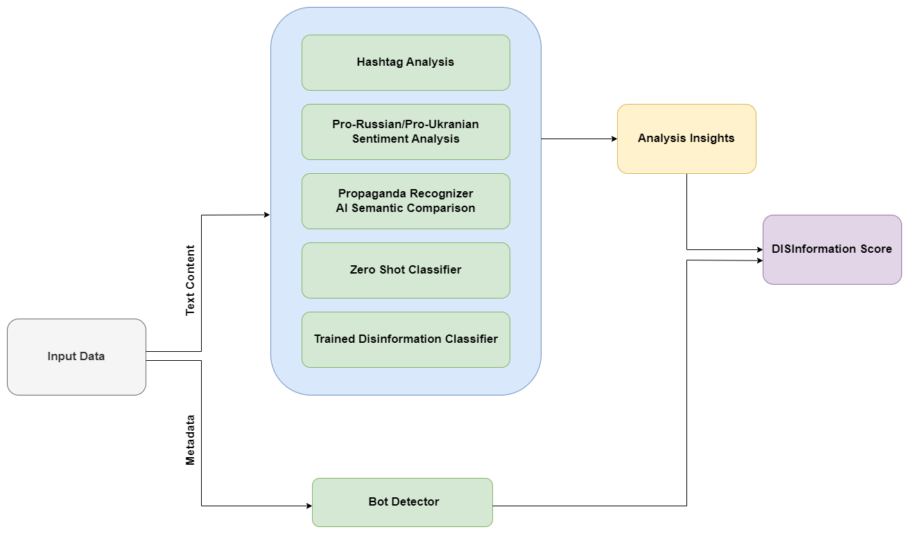

# STADFEST: A Disinformation Analyser for TIDE Hackathon 2023

*NB: Work in progress*

(**TODO:** Explaination of the different folders and structure of the repo)

A short account of our process can be found [here](LOG.md)

## Notes

### Ideas

Time log over amount of disinformation to flag events.

Map to show where disinformation is coming from.

Running analysis on the dataset to find which hashtags are common
Manually choosing hashtags to flag as Pro-Russian and Pro-Ukrainian

Train a sentiment analysis network based on hashtags, but remove from tweet to keep the network from simply learning to look at hastags
and provide a more complex analysis of the sentiment of the content.

### Goal Product

A classifier consisting of several steps:

1) Neural network for Ukraine sentiment analysis based on modified dataset

2) Sematic likeness to known propaganda talking points from this article (https://www.oecd.org/ukraine-hub/policy-responses/disinformation-and-russia-s-war-of-aggression-against-ukraine-37186bde/)

3) NLP Classifier for disinformation

Give a total score based on the steps, while also giving explainability through the different metrics.

A report tab that uses metadata such as dates to display disinformation over time.

A draft diagram displaying a potential architecture:

### Models
BERT, SimCSE, T5, Sentence Transformer for sentence embedding.

HuggingFace, transformer module to run and build on existing models

Model + Classification Head for classification.

SimCSE or Sentence Transformer embedded text to for clustering or semantic likeness

### Data
Proxydata: IMDB, ...

*Datasets:*
 - tide-data (fra POL Cyber command)

 An explaination on how we modified the dataset, and scripts to replicate it can be found [here](data/)

Potential extra:
 - kaggle fake news (https://www.kaggle.com/competitions/fake-news/overview)
 - RussiaUkrainePropaganda dataset (https://ieee-dataport.org/documents/propaganda-and-fake-news-war-ukraine)
 - 3 million Russian troll tweets (https://www.kaggle.com/datasets/fivethirtyeight/russian-troll-tweets)

###  Python-packages
- feedparser
- bs4
- matplotlib
- pytorch
- torchvision
- numpy
- scikit-learn (sklearn)
- transformers
- datasets
- ipykernel
- tqdm
- streamlit = 1.18.1
- plotly
- nltk
- argostranslate

BI nevnte for geolokasjon: spacy, geopy

Offline translation from russian to english
https://skeptric.com/python-offline-translation/