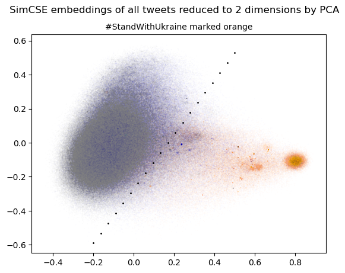

# Data

This folder contains scripts and notebooks used to modify the data set that was provided by the Polish Cyber Command into 
the datasets we have used in our application. A summary of the processes can be found below.

Our dataset and labels can be found on Azure: [LINK]

## Dataset modification

- Concatinated all twitter datasets
- Removed duplicates
- Added a column of hashtag free text
- Extracted user information on a more readable format and added a column to dataframe for each data point
- Calculated the age of the account at the time of each tweet

## Labelling protocol

Pseudo labelling of the data was done in a few diffrent ways.

### Semantic likeness to known propaganda
We used semantic likeness to known propaganda talking points, to create a misinformation/non misinformation label, using our *Zero-Shot Narrative Recognition* model. Read more about our models in the [README](../)

For a small subset, we manually verified 50 instances of misinformation in the dataset and made a dataset containing those 50 samples 
as well as 100 random samples that could be used as and a tiny training dataset.

We repeated the process to create a small test and demo dataset, so that we could ensure to have **train-test-split** for more reliable verification of our results.

The indexes of the verified misinformation entries are stored as .txt files and are available on Azure, together with our modified dataset.

### PCA
We also did [principle component anlysis](https://en.wikipedia.org/wiki/Principal_component_analysis) on data to divide it into binary classes. Tweets with a pro Ukranian sentiment seemed to cluster, as illustrated below, where tweets marked with the #StandWithUkraine hashtags is coded in orange.

